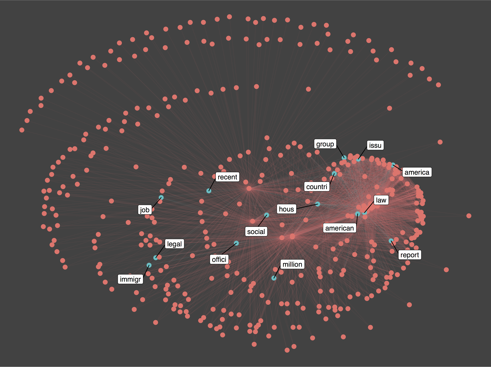

Materials for SOC/MDSC 43919: Text Analysis for Social Science
================
Marshall A. Taylor

Screens are all around us. From T.V.s to smartphones and e-books, the ubiquity of screens and the fact that we use them to communicate with one another means that virtually all of us create some form of “text data” every day.

Further, the proliferation of mass communication technologies over the past couple of decades—including the rise of social media, the emphasis on document digitization in archives, libraries, and organizations, and increasing access to these data—has opened the door to new questions for social scientists and to new data and methods for answering these questions. For example, do anti-immigration laws shape how people tweet about immigration? Does war shape how U.S. presidents frame the role of governance in society, as reflected in State of the Union addresses? What accounts for the gender gap in net neutrality activism? Did national news media or activist social media matter more for sparking \#BlackLivesMatter? Can Twitter sentiment predict stock market activity?

This course will introduce students to some of the methods that social scientists use to answer these types of questions. The focus will be on understanding and developing some of the fundamentals for designing and conducting text analysis projects from a social science perspective. We will also touch on some of the more advanced topics in this rapidly growing field. Hands-on analysis in the R statistical computing environment will be integral to the course, though no prior coding experience is required.
