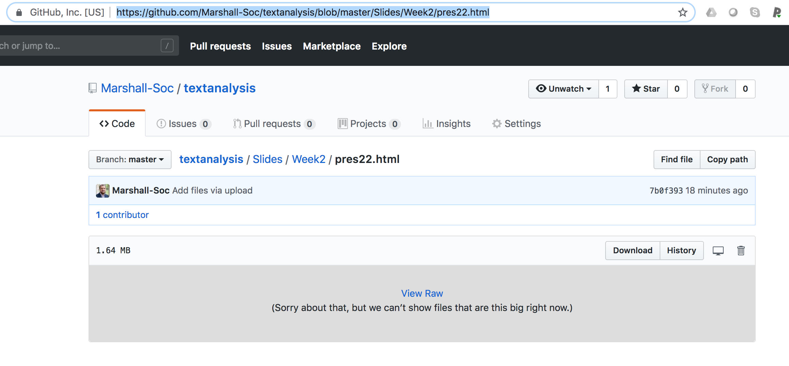
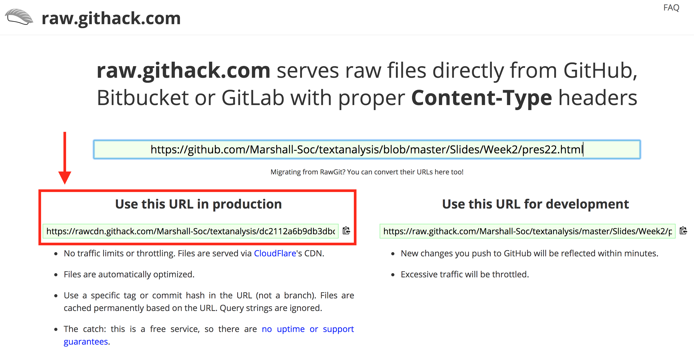

Rendering SOC/MDSC Slides
================
Marshall A. Taylor

You will need to use [raw.git.hack](https://raw.githack.com/) to render the HTML slides. Another option is to download and save the raw HTML files. **Note that the [GitHub and BitBucket HTML Preview method](https://htmlpreview.github.io/) *will not work*.**

So, say I want to render pres22.html in the "Week2" folder. I have two options. First, using raw.githack.com, I first "open" pres22.html. Once you have done this, copy the URL:

Then navigate over to [raw.githack.com](https://raw.githack.com/) and plug in the URL:

Copy the production URL and plug it back into your search bar. You should see the HTML slides rendered like this:

And that's it! Alternatively, you can download and save the raw file. First, view the raw HTML file:

The save that file once it shows up in your browser (on a Mac, this would be "Save Page As." Open up the saved HTML file, and it should render correctly.
